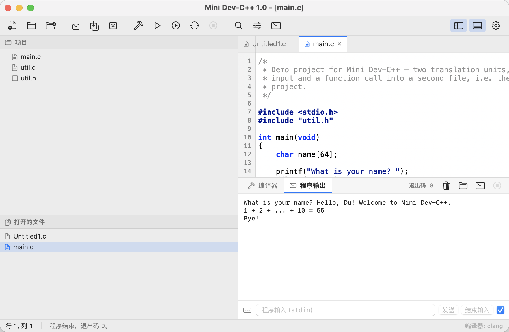
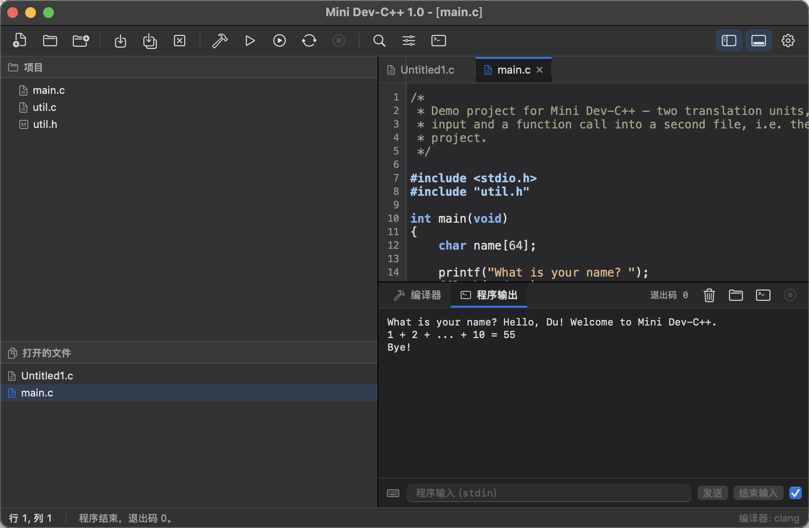
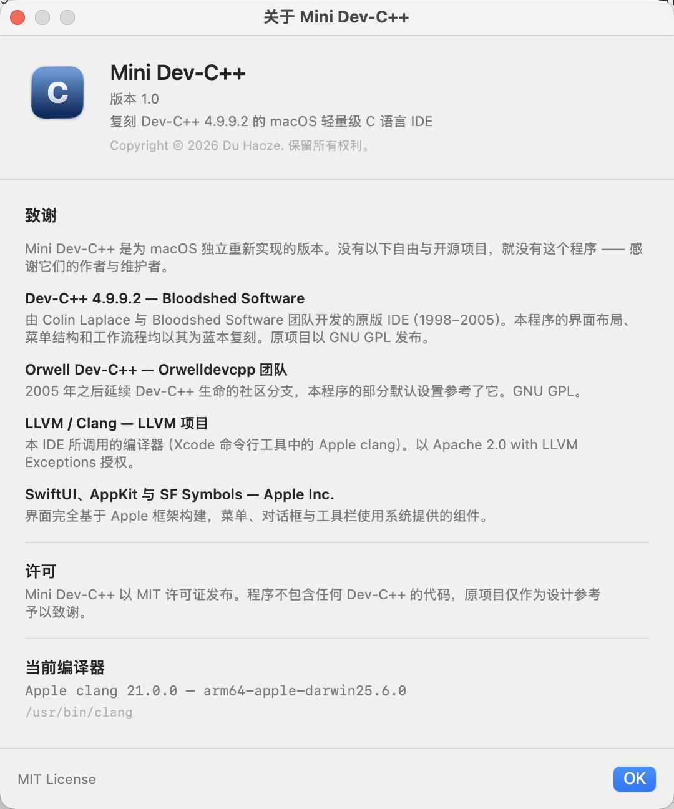

# Mini Dev-C++

A lightweight C IDE for macOS that recreates the Dev-C++ 4.9.9.2 experience — same
menu bar, same project explorer, same compile/run/console workflow — rebuilt with
SwiftUI for macOS 14 and later.



| Dark appearance | About & credits |
| --- | --- |
|  |  |

## Features / 功能

- **Dev-C++ layout and menu bar** — File, Edit, Search, View, Project, Execute, Tools, Window, Help,
  with the familiar toolbar (new / open / save, compile, run, compile & run, rebuild, stop, find).
- **Editor built for C** — Dev-C++ colour scheme (bold blue reserved words, navy preprocessor lines and
  string literals, grey comments), line-number gutter, smart indentation on `{`, `}` de-indent,
  configurable tab width / spaces, word wrap, current-line highlight, ⌘/ line comment toggle, and the
  native find & replace bar.
- **Real build pipeline** — compiles with the local `clang` (Xcode Command Line Tools). A single file
  compiles on its own; with a folder open as a project every `.c`/`.cpp`/`.m` file is compiled and linked
  into one executable, exactly like a Dev-C++ project. Choose the C standard, extra flags, `-g`, and the
  output location (next to the sources, Dev-C++ style, or in a `build` subfolder).
- **Clickable diagnostics** — errors and warnings are parsed out of clang's output; click a diagnostic to
  jump straight to the offending line, with the full compiler log underneath.
- **Program console** — the compiled program runs inside the app with live stdout/stderr, an interactive
  stdin field (send lines, send EOF, stop), the exit code, and a one-click "Run in Terminal" for programs
  that need a real terminal.
- **Run parameters** — pass `argv` arguments and pre-fill stdin, like Dev-C++'s Execute ▸ Parameters.
- **Bilingual UI, three languages** — English, 简体中文, 繁體中文, either following the system or pinned
  in Options. Even the menus macOS builds itself are localized through bundled `Localizable.strings`.
- **Light / dark / follow system** — the whole interface and the editor palette adapt; the dark editor
  keeps the Dev-C++ colour relationships.
- **Completely offline** — no networking code at all: no telemetry, no update checks, no accounts. Your
  sources only ever reach the local compiler.

## Requirements / 环境要求

- macOS 14.0 or later (Apple silicon or Intel).
- The Xcode **Command Line Tools** for `clang`: `xcode-select --install`.
  (Full Xcode is *not* required.)

## Build / 构建

```bash
git clone git@github.com:duhaoze2007/MiniDevCpp.git
cd MiniDevCpp
bash build.sh          # builds MiniDevCpp and produces "Mini Dev-C++.app"
open "Mini Dev-C++.app"
```

`build.sh` signs the bundle ad-hoc, copies `Info.plist`, the icon and the localized
resources, and prints the SDK it used. To install the app: drag `Mini Dev-C++.app`
into `/Applications`.

### Note about the Command Line Tools toolchain

Since the macOS 26/27 SDK, SwiftUI's property wrappers (`@State`, `@Binding`, …) are
macros whose implementation (`libSwiftUIMacros.dylib`) ships **only inside Xcode**. A
Command Line Tools-only toolchain therefore cannot expand them. `build.sh` detects
this and builds against the newest installed SDK whose SwiftUI declares no such macros
(`MacOSX26.5.sdk` on this machine); the resulting binary still runs on the current
macOS. If you have Xcode installed, no workaround is applied. Export `SDKROOT`
yourself to override the choice.

## Usage / 使用

1. `⌘N` for a new file, `⌘O` to open a `.c` file, or **File ▸ Open Folder as Project…**
   to load a folder as a project (its sources appear in the project explorer).
2. Write C code; keywords, comments, strings and directives are highlighted as you type.
3. `⌘B` compiles, `⌘R` runs, `⌘⏎` compiles and runs in one step, `⇧⌘B` rebuilds everything,
   `⌘.` stops a running program.
4. Errors appear in the **Compiler** tab — click one to jump to that line. Program output and
   stdin live in the **Program Output** tab.
5. Options (`⌘,`) holds the appearance switch, language picker, editor settings, compiler path,
   C standard, extra flags and the output location.

### Keyboard shortcuts / 快捷键

| Shortcut | Action / 操作 |
| --- | --- |
| `⌘N` / `⌘O` / `⇧⌘O` | New file / Open file / Open folder as project |
| `⌘S` / `⇧⌘S` / `⌥⌘S` | Save / Save As / Save All |
| `⌘B` / `⇧⌘B` | Compile / Rebuild all |
| `⌘R` / `⌘⏎` / `⌘.` | Run / Compile & Run / Stop |
| `⌘F` / `⌥⌘F` / `⌘G` / `⇧⌘G` | Find / Replace / Find next / Find previous |
| `⌘L` | Go to line |
| `⌘/` | Comment / uncomment the selection |
| `⌘1` / `⌘2` | Show or hide the project explorer / output window |
| `⌘+` / `⌘-` | Bigger / smaller editor font |

## Credits / 致谢

Mini Dev-C++ is an independent macOS re-implementation. It exists thanks to:

- **Dev-C++ 4.9.9.2 — Bloodshed Software** (Colin Laplace and team, 1998–2005, GNU GPL): the original
  IDE whose layout, menus and workflow this app recreates. No source code from it is used.
- **Orwell Dev-C++ — Orwelldevcpp Team** (GNU GPL): the community fork that kept Dev-C++ alive after
  2005; several defaults here follow it.
- **LLVM / Clang — LLVM Project** (Apache 2.0 with LLVM Exceptions): the compiler this IDE drives
  (Apple clang from the Xcode Command Line Tools).
- **SwiftUI, AppKit and SF Symbols — Apple Inc.**: the interface is built entirely on Apple's frameworks.

The same list is shown inside the app under **Help ▸ About Mini Dev-C++**.

## License / 许可

MIT License — see [LICENSE](LICENSE).

Copyright © 2026 Du Haoze. Mini Dev-C++ contains no code from Dev-C++; the original project is credited
as the design reference only.

---

# Mini Dev-C++（中文说明）

一个为 macOS 打造的轻量级 C 语言 IDE，复刻 Dev-C++ 4.9.9.2 的使用体验 —— 相同的菜单栏、项目浏览器、
编译/运行/控制台工作流 —— 用 SwiftUI 为 macOS 14 及以上系统重新实现。


| 深色外观 | 关于与致谢 |
| --- | --- |
|  |  |

## 功能

- **Dev-C++ 的布局与菜单栏** —— 文件、编辑、搜索、视图、项目、运行、工具、窗口、帮助，以及熟悉的工具栏
  （新建 / 打开 / 保存、编译、运行、编译并运行、全部重新编译、停止、查找）。
- **面向 C 的编辑器** —— Dev-C++ 配色（关键字蓝色加粗、预处理指令与字符串常量深蓝、注释灰色），行号栏，
  大括号智能缩进、`}` 自动回退缩进，Tab 宽度与"空格代替 Tab"可调，自动换行、当前行高亮，⌘/ 注释切换，
  以及系统原生的查找替换栏。
- **真实的编译流程** —— 调用本机 `clang`（Xcode 命令行工具）编译。打开单个文件即编译该文件；打开文件夹作为
  项目后，其中的全部 `.c`/`.cpp`/`.m` 文件会被编译并链接为同一个可执行文件，与 Dev-C++ 项目完全一致。
  可选择 C 标准、附加参数、是否生成调试信息，以及输出位置（与源文件同目录的 Dev-C++ 风格，或 `build` 子目录）。
- **可点击的诊断信息** —— 从 clang 输出中解析错误与警告，点击即可跳转到对应行，下方保留完整编译日志。
- **程序控制台** —— 编译后的程序在应用内运行，实时显示标准输出/错误，支持交互式 stdin（发送一行、结束输入、
  停止），显示退出码，并可一键"在终端中运行"（适合需要完整终端交互的程序）。
- **运行参数** —— 可传入 `argv` 参数并预填标准输入，相当于 Dev-C++ 的"运行 ▸ 参数"。
- **中英双语（三语言）** —— English、简体中文、繁體中文，可跟随系统或在选项中固定。连 macOS 自行构建的
  菜单也通过随包的 `Localizable.strings` 一并本地化。
- **浅色 / 深色 / 跟随系统** —— 界面与编辑器配色同步切换，深色方案保留 Dev-C++ 的色彩关系。
- **完全离线** —— 不含任何网络代码：无遥测、无更新检查、无账号。源代码只会交给本机的编译器。

## 环境要求

- macOS 14.0 或更高版本（Apple 芯片或 Intel）。
- 提供 `clang` 的 Xcode **命令行工具**：`xcode-select --install`（无需安装完整 Xcode）。

## 构建

```bash
git clone git@github.com:duhaoze2007/MiniDevCpp.git
cd MiniDevCpp
bash build.sh          # 构建 MiniDevCpp 并生成 "Mini Dev-C++.app"
open "Mini Dev-C++.app"
```

`build.sh` 会进行临时签名（ad-hoc），拷贝 `Info.plist`、图标与本地化资源，并打印所使用的 SDK。
安装方式：把 `Mini Dev-C++.app` 拖入 `/Applications`。

### 关于命令行工具链的说明

自 macOS 26/27 SDK 起，SwiftUI 的属性包装器（`@State`、`@Binding` 等）改为宏实现，其实现文件
`libSwiftUIMacros.dylib` **只随 Xcode 提供**。因此仅安装命令行工具的机器无法展开这些宏。`build.sh` 会自动
检测并改用"最新一个 SwiftUI 未把这些声明为宏"的 SDK（本机为 `MacOSX26.5.sdk`）来构建，产物仍可在当前
macOS 上正常运行。若已安装 Xcode，则不启用该回退。也可自行导出 `SDKROOT` 覆盖。

## 使用

1. `⌘N` 新建文件，`⌘O` 打开 `.c` 文件，或用「文件 ▸ 打开文件夹作为项目…」把文件夹作为项目载入
   （其中的源文件会出现在左侧项目浏览器中）。
2. 直接编写 C 代码，关键字、注释、字符串与指令会即时高亮。
3. `⌘B` 编译，`⌘R` 运行，`⌘⏎` 一步编译并运行，`⇧⌘B` 全部重新编译，`⌘.` 停止正在运行的程序。
4. 错误与警告显示在「编译器」标签中 —— 点击即可跳转到对应行；程序输出与 stdin 位于「程序输出」标签。
5. 「选项」（`⌘,`）中可切换外观、选择语言、调整编辑器设置、编译器路径、C 标准、附加参数与输出位置。

## 致谢

Mini Dev-C++ 是为 macOS 独立重新实现的版本，它的存在归功于：

- **Dev-C++ 4.9.9.2 — Bloodshed Software**（Colin Laplace 及团队，1998–2005，GNU GPL）：原版 IDE，
  本程序的界面布局、菜单结构和工作流程均以其为蓝本复刻；程序不包含其任何源代码。
- **Orwell Dev-C++ — Orwelldevcpp 团队**（GNU GPL）：2005 年后延续 Dev-C++ 生命的社区分支，
  本程序的部分默认设置参考了它。
- **LLVM / Clang — LLVM 项目**（Apache 2.0 with LLVM Exceptions）：本 IDE 调用的编译器
  （Xcode 命令行工具中的 Apple clang）。
- **SwiftUI、AppKit 与 SF Symbols — Apple Inc.**：界面完全基于 Apple 框架构建。

同一份名单也显示在应用内「帮助 ▸ 关于 Mini Dev-C++」中。

## 许可

MIT 许可证 —— 详见 [LICENSE](LICENSE)。

Copyright © 2026 Du Haoze。程序不包含任何 Dev-C++ 的代码，原项目仅作为设计参考予以致谢。
